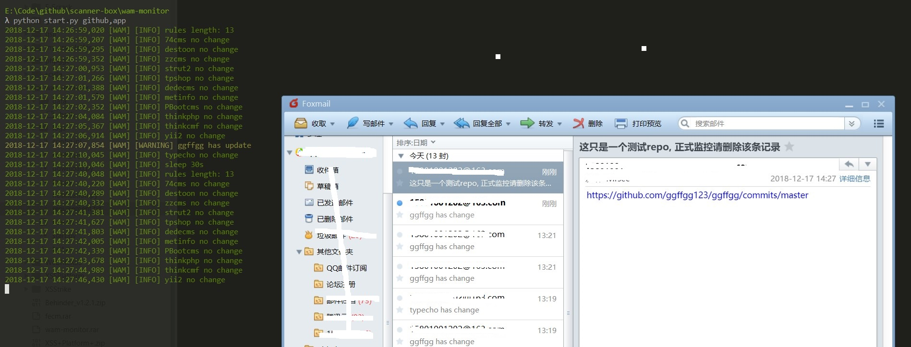

## wam-monitor
之前捣鼓了半天创宇的wam, 没明白怎么弄，干脆自己写一个简单的版本，可以实现对github以及一些开源cms官网的更新页面进行监控并发邮件通知。

借鉴了蘑菇街的github监控工具[GSIL](https://github.com/FeeiCN/GSIL)  的思路和部分代码，感谢！

## INSTALL & USE

	pip install -r requirement.txt
	python start.py

修改config.ini的邮箱信息

```
[mail]
host : smtp.163.com
port : 25
mails : xxx@163.com
from : WAM
password : password
to : xx@qq.com,xx@163.com
cc : 
```

需要两个邮箱, mails是发件人邮箱，to是接收人邮箱，cc是抄送邮箱可不填

rules.ini 为监控规则, 格式如下
```
{
	"github":{
		"ggffgg":{
			"url":"https://github.com/ggffgg123/ggffgg/commits/master",
			"message":"这只是一个测试repo, 正式监控请删除该条记录"
			'selector":"div.repository-content"
		}
	}
}
```

url: 监控的页面链接
selector: 监控某个标签的内容，因为很多cms官网页面都有动态的css,js，如果直接监控整个页面没有效果，因此如果页面为动态页面，需要添加
selector 来监控某一个标签的内容。 目前支持两种标签:
```
div.download 表示监控: <div class="download"></div> 的内容
ol#down 表示监控 <ol id="down"></div> 的内容
```

message: 发送邮件的主题，默认可以不填写。

> 三个属性中url是必填，message可不填，selector可不填，github默认selector为repository-content,app默认selector为None,即只监控静态页面。 


## 功能
- [x] 监控github commit 信息
- [x] 监控cms官网 版本更新
- [x] 邮件通知
- [x] 现在可监控13个cms的更新


## 功能截图


## 可以监控的cms 
```
{
	"github":{
		"ggffgg":{
			"url":"https://github.com/ggffgg123/ggffgg/commits/master",
			"message":"这只是一个测试repo, 正式监控请删除该条记录"
		},
		"thinkphp":{
			"url":"https://github.com/top-think/framework/commits/5.1",
			"message":"thinkphp 有更新commit"
		},
		"yii2":{
			"url":"https://github.com/yiisoft/yii2/commits/master",
			"message":"yii2 有更新commit"
		},
		"thinkcmf":{
			"url":"https://github.com/thinkcmf/thinkcmf/commits/master",
			"message":"thinkcmf 有更新commit"
		},
		"typecho":{
			"url":"https://github.com/typecho/typecho/commits/master"
		}
	},
	"app":{
		"zzcms":{
			"url":"http://www.zzcms.net/about/6.htm",
			"message":"zzcms 有更新版本"
		},
		"tpshop":{
			"url":"http://www.tp-shop.cn/download/",
			"selector":"div.download_body"
		},
		"metinfo":{
			"url":"https://www.metinfo.cn/download/",
			"selector":"ol.breadcrumb met-pinghei margin-vertical-20 padding-0 font-size-16"
		},
		"dedecms":{
			"url":"http://www.dedecms.com/",
			"selector":"div#down"
		},
		"destoon":{
			"url":"http://www.destoon.com/download/",
			"selector":"div#download"
		},
		"74cms":{
			"url":"http://www.74cms.com/download/index.html",
			"selector":"div.downright link_blue"
		},
		"PBootcms":{
			"url":"https://www.pbootcms.com/changelog.html",
			"selector":"div.container pages"
		},
		"strut2":{
			"url":"https://cwiki.apache.org/confluence/display/WW/Security+Bulletins",
			"selector":"div.page view"
		}
	}
}
```